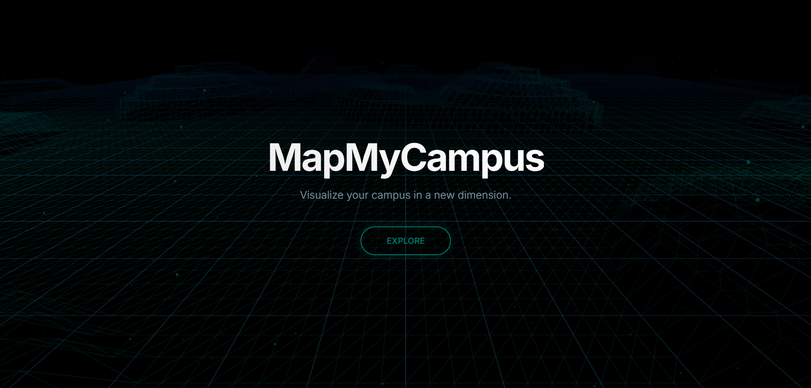

# MapMyCampus 🗺️✨

Welcome to **MapMyCampus**! This is an interactive, AI-powered companion tool designed to help you explore, find your way around campus with ease and also help you learn more about your Campus. Whether you prefer a classic 2D map or an immersive 3D experience, our smart assistant is here to guide you.

---

## 🚀 Live Demo

Experience MapMyCampus live right now! Click the preview below to open the application.

---

## What is MapMyCampus?

**MapMyCampus** is more than just a map. It's a smart companion for campus life. You can ask it for directions, find specific buildings, or even ask general questions about the campus. Our goal is to make campus navigation intuitive, accessible, and maybe even a little bit fun.

---

## Key Features

- 💬 **Conversational AI Assistant**  
  Simply chat with our friendly bot to get the information you need. Ask things like "Where is the library?" or "Show me the way from the hostel to the lecture hall."

- ✌️ **Dual Map Views**  
  Choose the experience that suits you best:
  - 📍 **2D Map View**: A classic, top-down map powered by Google Maps for clear, precise walking directions and location pinpointing.
  - 🏛️ **3D Immersive View**: Explore a detailed 3D model of the campus. It's a great way to get a feel for the environment before you even set foot there!

- 🎙️ **Voice Commands**  
  Don't feel like typing? Use the microphone button to ask your questions with your voice.

- 🔊 **Audio Responses**  
  The assistant can read its answers out loud, making it perfect for when you're on the move.

- 📱 **Fully Responsive**  
  Use it on your desktop, tablet, or phone. The interface adapts seamlessly to any screen size.

---

## Technical Details & Setup

Are you a developer interested in how MapMyCampus works or want to set it up locally? We've prepared detailed guides for both the frontend and backend components.

- ➡️ [**Frontend README**](Frontend/README.md): Get instructions on how to set up the user interface, including the 2D map, 3D viewer, and all the client-side logic.

- ➡️ [**Backend README**](Backend/README.md): Learn how to set up the FastAPI server, configure the AI models (Google Gemini), and manage the database for locations and knowledge.

---

## Creators

  

    <a href="https://github.com/ASHISH-28-02">
      
      
ASHISH B

    </a>
  

    <a href="https://github.com/Rayhana27">
      
      
RAYHANA S

    </a>
  

---

## Contributors

Thanks to these wonderful people who have contributed to the project. 

---

## License

This project is licensed under the **MIT License**. See the [`LICENSE.md`](LICENSE) file for details.
